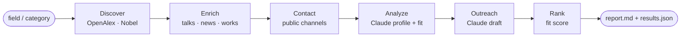

# 🔭 Expert Sourcing Agent

**Find the world's leading scholars in any field, understand their work, locate
their public contact channel, and draft outreach that actually earns a reply —
so AI labs can bring real domain experts into the feedback loop.**

> The bottleneck in modern AI isn't compute — it's **high-quality human feedback
> from people who genuinely know the domain.** RLHF, evaluations, red-teaming, and
> benchmark authoring all get better when a real physicist, physician, or
> mathematician is judging the model. This agent automates the tedious 80% of
> that work (finding, profiling, reaching) so a human can focus on the 20% that
> matters: the relationship.

```
    a field  ─▶  DISCOVER  ─▶  ENRICH  ─▶  CONTACT  ─▶  ANALYZE  ─▶  OUTREACH  ─▶  RANK
             OpenAlex/Nobel   talks/news   public      Claude       Claude       fit score
                              /citations   channels    profile     draft note
```

---

## ✨ Try it in 10 seconds (no keys, no setup)

```bash
git clone https://github.com/sdwawa951753/expert-sourcing-agent
cd expert-sourcing-agent
python cli.py --demo
```

The demo runs the **entire pipeline offline** on synthetic data — ranking,
profiling, contact, and a drafted outreach email — so you can see the shape of
the output before adding any API keys.

```
  #  Fit   Name                      Institution                 Contact
  ------------------------------------------------------------------------------
  1  0.73  Ada Renwick               Institute for Cognitive Sy  email
  2  0.65  Priya Anand               Riverbank College of Medic  email
  3  0.56  Tomas Iverson             Northwave University        homepage form ★

  Top pick: Ada Renwick — draft subject: "Machine learning: shaping how frontier AI learns"
```

<details>
<summary>📄 Example drafted outreach (click to expand)</summary>

> **Subject:** Machine learning: shaping how frontier AI learns
>
> Dear Prof. Renwick,
>
> I've been reading your paper "Faithful Reasoning Under Reward Misspecification",
> and it's exactly the kind of rigor that frontier AI models need more of right now.
>
> I lead the Expert Network at Surge AI. We connect leading researchers with AI
> labs that need expert human feedback to evaluate and improve their models —
> paid, flexible, and built around your schedule.
>
> Would you be open to a 20-minute intro call in the next couple of weeks?
>
> Warm regards,
> [Your Name]

</details>

---

## 🚀 Real runs

`OpenAlex` needs **no API key**, so live discovery works immediately:

```bash
# rank the top experts in a field
python cli.py "large language model alignment" --limit 10

# start from Nobel laureates in a category
python cli.py --nobel physics --limit 15
```

Add keys (see [`.env.example`](.env.example)) to unlock the rest:

```bash
export ANTHROPIC_API_KEY=sk-ant-...     # Claude writes the profiles + outreach
export TAVILY_API_KEY=tvly-...          # enriches with public talks & news
export OPENALEX_MAILTO=you@example.com  # OpenAlex "polite pool" (faster)

python cli.py "computational biology" --limit 8 --out results/
```

Every run writes a ranked **`results/report.md`** (human-readable shortlist with
profiles + draft emails) and **`results/results.json`** (structured, for piping
into a CRM or spreadsheet).

---

## 🧠 How it works

| Stage | Module | What it does |
|------|--------|--------------|
| **Discover** | `discover.py` | Top-cited authors in a field via **OpenAlex**; pull/flag **Nobel laureates** via the Nobel Prize API. |
| **Enrich** | `enrich.py` | Their most-cited works + public **talks/keynotes/interviews** and **news** (via pluggable search). |
| **Contact** | `contact.py` | **Public, professional** channels only — ORCID, faculty page, personal site. |
| **Analyze** | `analyze.py` | Claude synthesizes a profile + a concrete **"fit for AI-feedback work"** read + personalization hooks. |
| **Outreach** | `outreach.py` | Claude drafts a short, specific, reply-worthy note (see the [Outreach Playbook](docs/OUTREACH_PLAYBOOK.md)). |
| **Rank** | `score.py` | Transparent, tunable fit score: relevance · seniority · responsiveness · reachability. |



Every stage **degrades gracefully**: no Claude key → offline templates; no search
key → citation-only evidence; no `PyYAML`/`rich` → sane defaults + plain output.
Nothing crashes, so the demo always runs.

---

## 🎯 Why this maps to real AI-lab work

Frontier labs increasingly source **domain experts** — not generic annotators —
to rate outputs, write hard eval items, and red-team models in law, medicine,
math, and the sciences. Building and running that expert network is exactly the
bridge-between-engineers-and-experts problem this tool is built for. It turns a
manual, relationship-heavy sourcing workflow into a repeatable pipeline while
keeping the human firmly in charge of the actual outreach.

---

## 🛟 Responsible use

This is a tool for **personalized, opt-in, one-to-one** professional outreach —
not a scraper or a spam cannon. It uses only public research data and
self-published professional contact channels, and it **drafts** messages for a
human to review and send. Please read **[docs/RESPONSIBLE_USE.md](docs/RESPONSIBLE_USE.md)**
before running it on real people, and comply with CAN-SPAM / GDPR and each API's
terms.

---

## 🗺️ Roadmap

- [ ] Semantic Scholar + arXiv as additional discovery sources
- [ ] De-duplication / disambiguation across sources
- [ ] Response-rate tracking to learn which hooks actually work
- [ ] CSV export + optional Airtable / Notion sync
- [ ] A tiny web UI over the JSON output

---

## 🌱 Origin

Built by someone who has done this by hand: as a chief of staff I once recruited
**10+ Nobel laureates** to a global science program at **zero honorarium** — the
replies came from specificity and respect, never from clever tricks. This project
encodes that judgment (see the [Outreach Playbook](docs/OUTREACH_PLAYBOOK.md)) so
it scales without losing the human touch.

*Contributions and issues welcome.* · MIT licensed.
